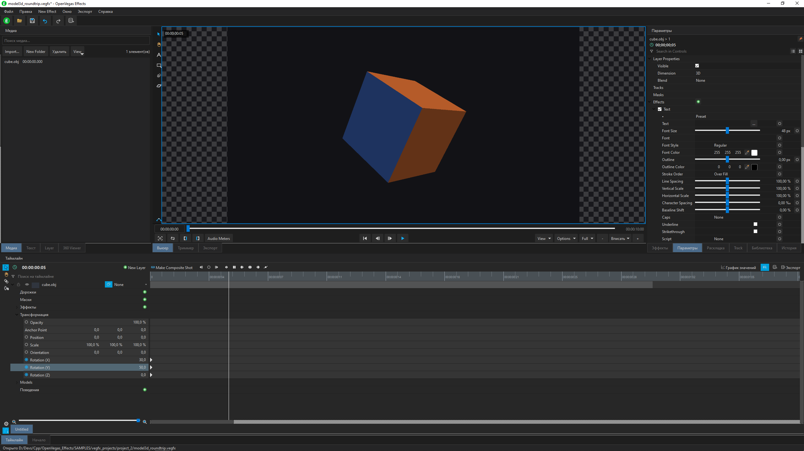

# OpenVegas Effects

Открытая (clean-room) реимплементация композитинга / эффект-приложения в стиле
**VEGAS Effects** на **C++17 / Qt 6** с лицензией **GNU GPL v3**.

Написано с нуля по поведенческой архитектуре, выявленной при реверс-инжиниринге
референсных бинарников (см. `SAMPLES/VEGAS_Effects/MARKDOWN/RE_VegasEffects.md`).
Это **оригинальный код**: проприетарных исходников не копируется. Раскладка
модулей повторяет наблюдаемую высокоуровневую структуру референс-приложения,
чтобы проект мог постепенно вырасти в совместимый рабочий процесс, но каждая
строка написана заново.

Сейчас: **ранний каркас** — окно с доками, свободный license manager, скан и
реестр плагинов, объектная модель композиции, SQLite-кэш, placeholder‑рендер.

---

## Скриншот



---

## Что уже работает

| Область | Статус |
|---------|--------|
| Вход (WinMain → UTF‑8 argv → QApplication) | Done |
| Папки пользовательских данных (11 шт., создаются при первом запуске) | Done |
| Settings через QSettings (ini) | Done |
| Логирование в файл | Done |
| Свободный manager лицензий (без активации / серверов) | Done |
| PluginManager + реестр, нативное обнаружение `.vfx` в `Plugins/` | Done (скан/реестр) |
| Объектная модель композиции / слои / клипы / эффекты | Каркас |
| MediaManager / импорт медиа | Каркас |
| SQLite-кэш (`CacheDB`) | Done |
| Фоновый render-воркер (placeholder) | Каркас |
| UI: MainWindow + доки (Effects panel, Viewer, Timeline) | Done (каркас) |
| Learn sidebar на Qt WebEngine (+ мост QWebChannel) | Done (каркас, MSVC-кит) |

Подробности и план — [`MARKDOWN/ARCHITECTURE.md`](MARKDOWN/ARCHITECTURE.md).

---

## Стек

| Слой | Выбор |
|------|--------|
| Язык / UI | C++17, Qt 6 (Widgets, UI строится в коде) |
| Web-поверхности | Qt WebEngine + WebChannel (опционально, только MSVC-кит) |
| Сборка | CMake 3.21+ (предпочтительно) и `OpenVegasEffects.pro` |
| Компиляторы | MSVC 2022, LLVM‑MinGW (Clang), MinGW, GCC |
| Медиа | **libVLC** — видеокадры, PCM мастер-микс, аудиовыход и запись voiceover |
| Кэш | QtSql (SQLite `cache.db`) |
| Плагины | Основа для будущего OFX‑хоста |
| Лицензия | GNU GPL v3 ([LICENSE](LICENSE)) |

---

## Сборка и запуск

Требуется **Qt 6.8+** (Core/Gui/Widgets/OpenGLWidgets/Sql). Опционально —
**Qt WebEngine + WebChannel + Network** для панели Learn. Перед rebuild на
Windows закройте `OpenVegas Effects.exe`, если линковка падает из‑за занятого
файла.

### libVLC (медиа)

Qt Multimedia больше не требуется. libVLC декодирует видео и звук, выводит PCM
мастер-микс и захватывает микрофон. Микшер учитывает интервалы клипов, mute,
source offset, скорость, уровень и вложенные композиции; Audio Meters измеряет
тот же итоговый PCM. Изменение скорости использует ресемплирование с изменением
высоты тона. Realtime native `.hfpl` DSP/AudioTransition ещё не подключены;
экспорт звука сохраняет отдельный путь FFmpeg/native DSP.

Заголовки и исходники VLC находятся в `thirdparty/vlc`. Это дерево исходников,
а не готовый runtime. Адаптер `Vlc4Adapter.cpp` использует его заголовки и
проверяет ABI VLC 4; VLC 3 использует отдельные совместимые сигнатуры.
В этой сессии запуск проверен с Windows VLC 3.0.24; адаптер VLC 4 собран,
но запуск с VLC 4 и проверки на macOS/Linux ещё предстоят.

Для упаковки подготовьте runtime соответствующей архитектуры в
`thirdparty/vlc/runtime/Windows`, `Darwin` или `Linux`: библиотеки вместе
с зависимостями и плагинами. Можно указать иной prefix через CMake
`-DOPENVEGAS_VLC_RUNTIME_DIR=<prefix>`; qmake читает одноимённую переменную
окружения. На Windows при отсутствии подготовленного runtime используется
установленный VLC из Program Files. Обе сборки копируют runtime в `vlc`
рядом с EXE; CMake install сохраняет эту структуру, а NSIS проверяет наличие
DLL и плагинов. Поставляются также `COPYING` и `COPYING.LIB`.

Загрузчик ищет библиотеки в `OPENVEGAS_VLC_DIR` (переопределение при запуске),
рядом с приложением, в настроенном prefix и системных каталогах.
Поддерживаются Windows DLL, macOS dylib и Linux SONAME; import-библиотека
не нужна. Без доступного libVLC приложение запускается, но медиа и запись
недоступны. Для записи используются DirectShow, qtsound или PulseAudio;
Linux перечисляет устройства через `pactl` (также PipeWire Pulse compatibility).
После перехода с Qt нужно заново выбрать микрофон в Options: старые base64 ID
устройств не совпадают с новыми ID. Аппаратная запись и вывод звука требуют
отдельной проверки на целевых ОС; тесты проверяют PCM и состояние VLC player.

### Qt Creator (qmake)

Откройте [`OpenVegasEffects.pro`](OpenVegasEffects.pro), kit **Qt 6.8+ Widgets**
(MSVC / MinGW / Clang) → Build. Держите `SOURCES`/`HEADERS` в синхроне с
`CMakeLists.txt`.

На Windows qmake создаёт актуальные `Makefile.Debug` и `Makefile.Release` для
шагов сборки Qt Creator. Заголовки форм, moc/rcc, объектные файлы и каталоги
переводов разделены по конфигурациям; исполняемый файл находится в `debug/`
или `release/` внутри shadow build. После изменения `.pro` выполните
**Build → Run qmake**. Старые Makefile от другой конфигурации могут давать
`C1083` для `QAudioBuffer` и `ui_*.h`, даже если новый основной Makefile уже есть.

### CMake

```bash
# LLVM-MinGW (рекомендуется, MSVC не нужен)
cmake -S . -B build -G "MinGW Makefiles" ^
  -DCMAKE_PREFIX_PATH=C:/Qt/6.9.3/llvm-mingw_64 ^
  -DCMAKE_C_COMPILER=C:/Qt/Tools/llvm-mingw1706_64/bin/clang.exe ^
  -DCMAKE_CXX_COMPILER=C:/Qt/Tools/llvm-mingw1706_64/bin/clang++.exe ^
  -DCMAKE_MAKE_PROGRAM=C:/Qt/Tools/llvm-mingw1706_64/bin/mingw32-make.exe
cmake --build build -j 8
```

### MSVC (пресеты)

Пресеты в [`CMakePresets.json`](CMakePresets.json) — единый источник правды для обеих IDE:

| Пресет | Тулчейн | Каталог |
|--------|---------|---------|
| `windows-msvc-debug` | MSVC v143 (VS 2022) + Qt `msvc2022_64` | `build/Windows_MSVC-x64/` |
| `windows-msvc-release` | то же, RelWithDebInfo | `build/Windows_MSVC-x64-Release/` |
| `windows-mingw-debug` / `-release` | MinGW GCC + Qt `mingw_64` | `build/Windows_MinGW-x64/` |

Из окна **x64 Native Tools Command Prompt for VS 2022**:

```bat
cmake --preset windows-msvc-debug
cmake --build --preset windows-msvc-debug --parallel
```

### GitHub Actions CI

При push в `main`, pull request и ручном запуске workflow [CI](.github/workflows/ci.yml)
собирает приложение MSVC 2022 с Qt 6.9.3, запускает шесть регрессионных
наборов через CTest и проверяет каталоги переводов. Сборка выполняется без
необязательного Qt WebEngine. Исходники libVLC находятся в репозитории; готовый
runtime VLC для этих проверок не нужен, поэтому CI не проверяет воспроизведение
медиа на реальном устройстве.

### Qt WebEngine (панель Learn)

Референс рендерит Home/Learn через Qt WebEngine (в его пакете лежит `QtWebEngineProcess.exe`),
здесь это панель **Learn** — `QWebEngineView` + мост `QWebChannel`, страница берётся из ресурса
`resources/learn.qrc`. Включается в меню **Window → Toggle Learn Sidebar**, состояние
запоминается.

Зависимость **опциональная**: на Windows Qt собирает WebEngine только для MSVC-китов, в
`mingw_64` его нет. Сборка сама определяет наличие модуля:

```
-- Qt WebEngine found - Learn sidebar enabled            # MSVC-кит
-- Qt WebEngine not found in this kit - Learn sidebar disabled   # MinGW-кит
```

Отключить принудительно: `cmake --preset windows-msvc-debug -DOPENVEGAS_WITH_WEBENGINE=OFF`.
В qmake наличие модулей проверяется автоматически; для принудительного отключения
добавьте `CONFIG+=no_webengine` в дополнительные аргументы qmake.
Признак в коде — `OPENVEGAS_HAVE_WEBENGINE`.

Из коробки в build-каталоге всё работает: `QtWebEngineProcess.exe` (в Debug — `…Processd.exe`)
и ресурсы Chromium берутся из Qt-префикса. Для дистрибутива их обязан разложить `windeployqt`.

**Remote debugging** повторяет поведение референса: если рядом с exe лежит `config.ini`,
приложение занимает свободный порт и выставляет `QTWEBENGINE_REMOTE_DEBUGGING` (в референсе —
`QTcpSocket::bind(0)` → `localPort()` → `qputenv`, до конструктора `QApplication`).

### OpenEXR (экспорт кадра в `.exr`)

У Qt нет плагина записи EXR, поэтому пресет **OpenEXR (.exr)** в панели Export
работает только в сборке с OpenEXR. По умолчанию выключено:

```bat
cmake --preset windows-msvc-debug -DOPENVEGAS_WITH_OPENEXR=ON
```

Порядок поиска: сначала установленный `find_package(OpenEXR 3 CONFIG)`, при
неудаче — исходники из [`thirdparty/openexr`](thirdparty/openexr).

**Оговорка про зависимость.** Рядом с `thirdparty/openexr` нет Imath, и
CMake OpenEXR тогда тянет его из GitHub (ветка `main`) прямо на этапе
configure — то есть сборка перестаёт быть офлайновой и воспроизводимой.
Сам склонированный OpenEXR — версии `4.0.0-dev` из `main`, тогда как референс
поставляет стабильную 3.1. Для повторяемости стоит зафиксировать теги релизов и
вендорить Imath рядом.

Без этой опции экспорт в `.exr` не падает молча, а сообщает, что сборка без
OpenEXR.

### VS Code и Zed (отладка на Qt MSVC)

Обе IDE настроены на Qt `msvc2022_64` и берут окружение MSVC сами — отдельный developer prompt
не нужен, задачи сборки вызывают `vcvars64.bat` (через `vswhere -version "[17.0,18.0)"`, чтобы
не поймать параллельно установленный VS 18, чей тулсет не соответствует Qt-киту).

Для кнопки сборки CMake Tools включено `cmake.useVsDeveloperEnvironment=always`,
а `cmake.buildTask=false` оставляет запуск расширению вместе с окружением пресета.
Задачи `Ctrl+Shift+B` и сборка перед F5 вызывают `tools/msvc_build.cmd`, который
сам загружает окружение MSVC. Для Ninja CMake также создаёт
`msvc_environment.cmd`: команды компиляции и линковки загружают окружение
установки, которой принадлежит выбранный `cl.exe`. Это предотвращает
`STL1001` при смешивании компилятора VS 2022 с заголовками VS 2026, даже если
CMake Tools выбрал окружение более новой Visual Studio. Для существующего
каталога сборки один раз выполните configure, чтобы обновить правила Ninja.
Из обычного терминала используйте:

```bat
tools\msvc_build.cmd build windows-msvc-debug
```

Скрипт можно запускать из любого каталога. Без аргументов он выполняет
`buildall windows-msvc-debug` (configure и build); также доступны `configure`,
`build`, `probe` и `clean`. Например, `tools\msvc_build.cmd clean windows-msvc-release`
очищает только результаты Release через CMake, сохраняя конфигурацию сборки.

Для установщика сначала соберите Release, установите приложение во временный
префикс и разложите зависимости Qt. Из корня проекта:

```bat
tools\msvc_build.cmd buildall windows-msvc-release
cmake --install build\Windows_MSVC-x64-Release --prefix build\installer-stage
"C:\Qt\6.9.3\msvc2022_64\bin\windeployqt.exe" --release build\installer-stage\bin\OpenVegasEffects.exe
"C:\Program Files (x86)\NSIS\makensis.exe" /DBUILD_DIR=build\installer-stage /DOUTPUT_FILE=build\OpenVegasEffects_Setup.exe tools\nsis_installer.nsi
```

NSIS требует подготовленный `bin` с приложением и `platforms\qwindows.dll`.
Во время компиляции `tools/nsis_payload.ps1` через Windows PowerShell составляет
список файлов, включая вложенные ресурсы Qt и добавленные в префикс плагины.
Удаление использует этот список и удаляет только опустевшие каталоги.

- **VS Code** — [`.vscode/`](.vscode/): `launch.json` (отладчик `cppvsdbg`, читает MSVC-PDB;
  конфигурации Debug / RelWithDebInfo / attach), `tasks.json` (configure / build / clean / run),
  `qt6.natvis` (человекочитаемые `QString`, `QList`, `QRect`… в отладчике). Расширения —
  в `extensions.json`. F5 собирает и запускает.
- **Zed** — [`.zed/debug.json`](.zed/debug.json) (адаптер CodeLLDB, PDB рядом с exe) и
  [`.zed/tasks.json`](.zed/tasks.json) с теми же пресетами. `clangd` индексирует
  `build/Windows_MSVC-x64/compile_commands.json`.

Запуск вне Qt Creator — добавьте Qt bin/plugins в PATH:

```powershell
$env:PATH = "C:/Qt/6.9.3/llvm-mingw_64/bin;" + $env:PATH
$env:QT_QPA_PLATFORM_PLUGIN_PATH = "C:/Qt/6.9.3/llvm-mingw_64/plugins"
```

**Не коммитьте** `build/` — он в [`.gitignore`](.gitignore).

---

## Локализация

Интерфейс переведён на русский, японский и упрощённый китайский; исходный язык —
английский.

| Язык | Покрытие | Источник |
|------|----------|----------|
| Русский | 216/233 | написан для этого порта |
| 日本語 | 206/233 | 79 строк из референсных `.qm`, остальное — для этого порта |
| 简体中文 | 206/233 | 79 строк из референсных `.qm`, остальное — для этого порта |

Непереведённое — форматные строки (`%1:%2:%3:%4`, `00:00:00:00`, `|<`, `+1`),
их переводить не нужно.

Терминология ja/zh взята из
`SAMPLES/VEGAS_Effects/Translations/*/VegasEffects_*.qm` (12041 сообщение,
конвертация через `lconvert`) — совпавшие по исходному тексту строки получают
формулировку самого референса. Строки, переведённые для порта, помечены
`<translatorcomment>` и видны в Qt Linguist как требующие вычитки носителем.

### Как это устроено

- Каталоги — [`translations/openvegaseffects_*.ts`](translations/); CMake
  компилирует их через `qt_add_translations` и встраивает в бинарник как
  `:/i18n/`. Нужен компонент Qt **LinguistTools**; без него сборка проходит,
  интерфейс остаётся английским.
- Загрузка — `app::Translations::install()`, вызывается в `main.cpp` **до**
  создания виджетов.
- Порядок поиска повторяет референс: сначала
  `<user data>/Translations/<locale>/openvegaseffects_<locale>.qm` (можно
  подложить свой каталог), затем встроенный. Рядом подхватывается `qt_<locale>.qm`.
- Язык выбирается в **Options → Interface → Язык**, ключ `Options/Language`;
  пусто = как в системе. Применяется при следующем запуске.

### Обновить каталоги после правки строк

```bat
cmake --build --preset windows-msvc-debug --target update_translations
```

---

## Папки данных времени выполнения

При первом запуске приложение создаёт папки пользовательских данных, повторяя
раскладку референса (восстановлена из его резолвера `FUN_14025b000`):
`Translations`, `Templates\AV`, `EnvironmentMaps`, `ExportPresets`,
`PluginPresets`, `Plugins`, `Presets`, `Textures`, `Templates\Workspaces`,
`Objects`, `Tutorials`. Две из них вложены в `Templates` — голой папки
`Templates` референс не отдаёт. На Windows корень — `%LOCALAPPDATA%\OpenVegas\OpenVegasEffects`.

Отличие от референса намеренное: тот каталоги только проверяет и при отсутствии
отдаёт пустой путь (дерево раскладывает инсталлятор), а этот порт инсталлятора
не имеет и создаёт их сам.

Положите файлы определений эффектов (`.vfx`, JSON) в папку `Plugins`, чтобы они
появились в панели **Effects**.

---

## Структура репозитория

```
OpenVegas_Effects/
├── CMakeLists.txt / OpenVegasEffects.pro
├── src/
│   ├── main.cpp          # WinMain-подобный вход → UTF-8 argv → QApplication
│   ├── core/             # Identifier, Result, Version, Log
│   ├── app/              # AppMain init, UserDataPaths, Settings
│   ├── license/          # LicenseManager + свободный manager
│   ├── plugin/           # Plugins/ , PluginPresets/ — поиск + registry
│   ├── media/            # импорт медиа
│   ├── composition/      # Composition / layers / clips / effects
│   ├── cache/            # SQLite-кэш (QtSql)
│   ├── render/           # фоновый render-воркер (placeholder)
│   └── ui/               # MainWindow, Effects panel, Viewer, Timeline
├── resources/            # иконки
├── MARKDOWN/             # планы / реверс-заметки для разработчиков
├── tools/                # утилиты (анализаторы, NSIS, svg_to_ico, …)
└── SAMPLES/              # референс-бинарники и реверс-заметки (не в сборке)
```

`SAMPLES/` содержит референс-бинарники и реверс-заметки; он не входит в
открытую сборку.

---

## Документация

1. **Архитектура и план** — [`MARKDOWN/ARCHITECTURE.md`](MARKDOWN/ARCHITECTURE.md)
2. **Правила разработки** — [`MARKDOWN/INIT.MD`](MARKDOWN/INIT.MD)
3. **Реверс референса VEGAS Effects** — [`MARKDOWN/RE_VegasEffects.md`](MARKDOWN/RE_VegasEffects.md)
4. **Разбор дистрибутива референса** — [`MARKDOWN/RE_VegasEffects_Distribution.md`](MARKDOWN/RE_VegasEffects_Distribution.md)

---

## Лицензия

Код этого репозитория, если не указано иное, — **GNU GPL v3**. Полный текст:
[`LICENSE`](LICENSE).

Референс-бинарники в `SAMPLES/` остаются собственностью правообладателей и
хранятся только для изучения.
